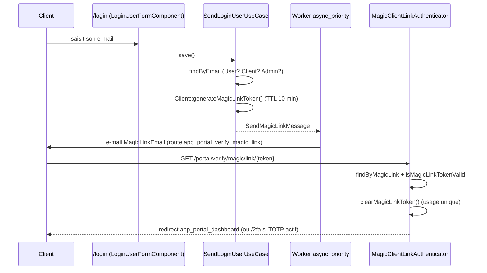
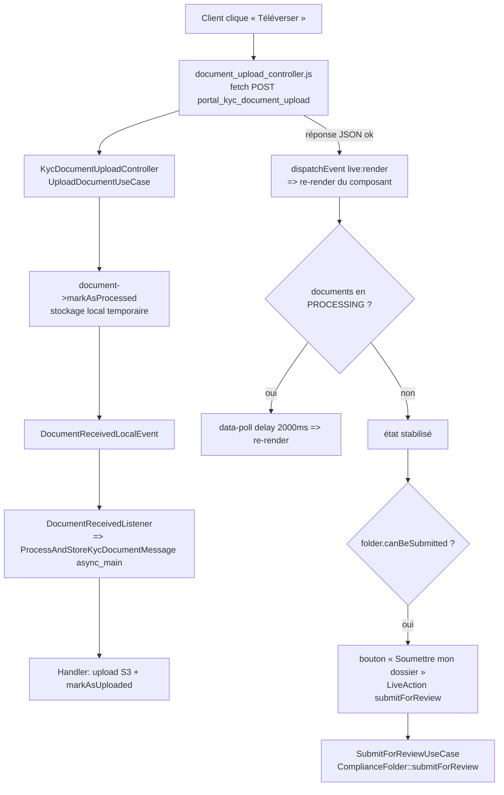

# Portail client final

_Dernière revue : 2026-09-06 — commit 84dbe01_

## En bref

Espace web où le **client final d'un CGP** se connecte, **sans mot de passe**, par
lien magique envoyé par e-mail. Il y suit l'avancement de son **dossier de
conformité**, dépose ses **pièces justificatives**, récupère son **DER** et
l'**attestation d'accusé de réception**, et met à jour son profil (prénom, nom,
téléphone). Le compte client n'existe qu'**après l'accusé de réception du DER**
(`ProvisionClientForFolderUseCase`, cf. domaine Compliance) : se connecter au
portail suppose donc un dossier actif. Toutes les URL sont sous `^/portal` et
passent par un firewall dédié (`portal`), étanche vis-à-vis de l'app CGP
(`main`).

## Le flux

### Connexion par lien magique

1. Le client saisit son e-mail sur `/login` (`LoginController`,
   `src/Infrastructure/Controller/Security/LoginController.php:21`). Le formulaire
   est un LiveComponent partagé avec les CGP/admins :
   `LoginUserFormComponent::save()`
   (`src/Infrastructure/User/Twig/Components/LoginUserFormComponent.php:46`).
2. `SendLoginUserUseCase` route l'e-mail vers la bonne population : `User` (CGP),
   puis `Client`, puis `Admin`
   (`src/Application/User/UseCase/SendLoginUserUseCase.php:47`). Pour un client,
   `handleClientLogin()` régénère le jeton
   (`SendLoginUserUseCase.php:103`) : `clearMagicLinkToken()` puis
   `generateMagicLinkToken()` (jeton `bin2hex(random_bytes(64))`, TTL **10 min**,
   `src/Domain/User/Entity/Client.php:187`). Réponse UI toujours générique
   (« si cette adresse est valide… ») pour ne pas divulguer l'existence du
   compte.
3. Un `SendMagicLinkMessage` est dispatché (transport `async_priority`,
   `config/packages/messenger.yaml:44`). `SendMagicLinkHandler` choisit la route
   `app_portal_verify_magic_link` pour un `UserType::CLIENT` et envoie l'e-mail
   `MagicLinkEmail` (`src/Infrastructure/User/Handler/SendMagicLinkHandler.php:58`).
   Si le destinataire est introuvable en base, le handler **abandonne
   silencieusement** (log `warning`).
4. Le client clique le lien `→ /portal/verify/magic/link/{token}`
   (`config/routes.yaml:9`). `MagicClientLinkAuthenticator::supports()` ne
   s'active que sur cette route + présence d'un `token`
   (`src/Infrastructure/Security/MagicClientLinkAuthenticator.php:36`).
5. `authenticate()` charge le `Client` via
   `ClientRepositoryInterface::findByMagicLink($token)` puis revérifie
   `credentials === $user->magicLinkToken` **et** `isMagicLinkTokenValid()`
   (jeton non nul + non expiré, `MagicClientLinkAuthenticator.php:44`,
   `Client.php:174`).
6. `onAuthenticationSuccess()` **détruit le jeton** (`clearMagicLinkToken()` +
   `save()`) — usage unique — puis redirige vers `app_portal_dashboard`
   (`MagicClientLinkAuthenticator.php:89`). En cas d'échec : redirection vers
   `app_login` (`MagicClientLinkAuthenticator.php:103`).
7. Si le client a activé la double authentification, Scheb intercepte avant la
   redirection et impose `/2fa` (`config/routes/scheb_2fa.yaml`,
   `config/packages/security.yaml:80`).
8. `/portal/logout` (`PortalSecurityController::logout()`,
   `src/Infrastructure/Controller/Security/PortalSecurityController.php:25`) est
   interceptée par la clé `logout` du firewall `portal`, cible `app_login`.



### Firewalls : `portal` vs `main`

| | Firewall `portal` | Firewall `main` (CGP) |
|---|---|---|
| Pattern | `^/portal` (`security.yaml:61`) | `^/` (`security.yaml:87`) |
| Provider | `app_client_provider` → entité `Client` (`security.yaml:11`) | `app_user_provider` → entité `User` |
| Authenticator | `MagicClientLinkAuthenticator` | `MagicLinkAuthenticator` |
| Jeton magique | **détruit** au succès (usage unique) | *non* détruit (`MagicLinkAuthenticator.php:96` commenté) |
| `user_checker` | aucun | `WorkspaceStatusChecker` |
| Throttling | 5 tentatives / 15 min | 3 tentatives / 15 min |
| Rôle exigé | `ROLE_CLIENT` sur `^/portal` (`security.yaml:130`) | `ROLE_USER` sur `^/app/` |
| 2FA | `two_factor` activé (`security.yaml:80`) | `two_factor` activé |

La route de vérification `/portal/verify/magic/link/{token}` tombe elle aussi
sous `^/portal` donc sous `access_control … ROLE_CLIENT` : ce n'est pas un
problème car l'`access_control` est évalué **après** l'authentification, et
l'authenticator a déjà connecté le client à ce stade.

### Pages authentifiées

Tous les contrôleurs sont mono-action, `#[IsGranted('ROLE_CLIENT')]`, et rendent
un template qui étend `@app/client/layout_client.html.twig`.

| Route | Nom | Contrôleur | Use case | Template |
|---|---|---|---|---|
| `GET /portal/account` | `app_portal_dashboard` | `ClientDashboardController` | `GetClientDashboardUseCase` + `GetClientFoldersUseCase` | `templates/app/client/dashboard.html.twig` |
| `GET /portal/folders` | `app_portal_folders` | `ClientFoldersController` | `GetClientFoldersUseCase` | `templates/app/client/folders.html.twig` |
| `GET /portal/folders/{id}` | `app_portal_folder_detail` | `FolderDetailController` | `GetFolderDetailUseCase` | `templates/app/client/folder_detail.html.twig` |
| `GET /portal/profile` | `app_portal_profile` | `ClientProfileController` | — (LiveComponent) | `templates/app/client/profile.html.twig` |
| `POST /portal/kyc/document/{documentId}/{folderId}/upload` | `portal_kyc_document_upload` | `KycDocumentUploadController` | `UploadDocumentUseCase` | JSON |

Fichiers : `src/Infrastructure/User/Controller/Client/ClientDashboardController.php:26`,
`ClientFoldersController.php:24`, `FolderDetailController.php:24`,
`ClientProfileController.php:18`,
`src/Infrastructure/KYC/Controller/KycDocumentUploadController.php:25`.

**Layout** (`templates/app/client/layout_client.html.twig`) : étend
`base_portal.html.twig` (`<!DOCTYPE>`, police Inter via Google Fonts,
`<meta robots noindex>`, grille d'arrière-plan). Il fournit :

- un header sticky avec le nom du cabinet (`company_name`, passé par chaque
  contrôleur depuis `Workspace::name`, repli `'KYSURE'`) ;
- le **menu avatar** (`data-controller="dropdown"`,
  `assets/controllers/dropdown_controller.js`) : identité du compte, lien
  « Mon profil », « Se déconnecter » vers `app_portal_logout`. Le contrôleur
  Stimulus gère `aria-expanded`, la fermeture au clic extérieur et sur `Échap`,
  le retour de focus ;
- une **sidebar** (masquée `< md`) : Vue d'ensemble / Mes dossiers / Mon profil,
  avec état actif calculé sur `app.request.attributes.get('_route')`.

### Dashboard (`GetClientDashboardUseCase`)

`src/Application/Portal/UseCase/GetClientDashboardUseCase.php:24`

1. `folderRepository->findActiveForClient($client)`. **Invariant** : un client
   connecté a forcément un dossier actif (son DER est accusé) ; sinon
   `LogicException` + log `critical` (`GetClientDashboardUseCase.php:31`).
2. `ClientPortalStatus::fromFolderStatus($folder->status)` traduit l'état métier
   (vu du CGP) en état UI (vu du client).
3. `documentRepository->countPendingForClient($client)` : le compteur de pièces
   en attente est **toujours** calculé (sinon le texte de la carte affirmait
   « tout est validé » pendant l'analyse cabinet — corrigé en commit `7fb791c`).
4. Multi-cabinet : `client->workspaces->first()` fournit `cabinetName` et
   `cabinetContactEmail` (`Workspace::email`, `null` → aucun lien e-mail affiché).
5. Retour d'un `ClientDashboardDto` portant un `ActiveFolderDto`
   (`src/Application/Portal/DTO/ClientDashboardDto.php`,
   `src/Application/Portal/DTO/ActiveFolderDto.php`).

Le template pilote le message et l'unique action primaire par
`dashboard.portalStatus.value` :

| `ClientPortalStatus` | Message | Action |
|---|---|---|
| `action_required` | « votre cabinet requiert N pièce(s)… » | bouton « Transmettre mes pièces » → détail dossier |
| `under_review` | « dossier transmis, analyse en cours, aucune action » | lien discret « Voir le détail » |
| `up_to_date` | « ensemble des documents vérifié et validé » | lien discret « Voir le détail » |

### Page dossier (`GetFolderDetailUseCase`)

`src/Application/Portal/UseCase/GetFolderDetailUseCase.php:26`

1. `folderRepository->findOneBySlugIdAndClient($folderId, $client)` — chargement
   **scopé au client** ; sinon `ComplianceFolderNotFoundException`.
2. Construit `FolderDetailDto` (`src/Application/Portal/DTO/FolderDetailDto.php`) :
   titre, référence, date d'ouverture, statut, `documents` (array de
   `DocumentItemDto`), et `der`.
3. **Bloc « Ce que vous avez déjà fait »** : `der` (`DerSummaryDto`,
   `src/Application/Portal/DTO/DerSummaryDto.php`) est rempli si
   `documentRepository->findDerByFolder($folder)` a un `storagePath` **et** un
   accusé en vigueur `ComplianceDocument::acknowledgementInForce()`
   (`src/Domain/Compliance/Entity/ComplianceDocument.php:384` — le premier
   `DerAcknowledgement` non révoqué, `isInForce()` = `revokedAt === null`). Le
   template affiche la date d'accusé, l'empreinte `pdfSha256`, et deux liens S3
   temporaires : le DER (`pdfStoragePath`) et l'attestation
   (`certificateStoragePath`, si générée), via le filtre Twig
   `private_url` → `DocumentStorageInterface::getTemporaryUrl()`
   (`src/Infrastructure/Shared/Twig/S3UrlExtension.php:26`).
4. **Bloc « Ce qu'il vous reste à faire »** : le template rend
   `<twig:ClientPortalDocumentListComponent folderId="…" />`. ⚠️ Ce LiveComponent
   **recharge lui-même** l'entité `ComplianceFolder` et itère
   `folder.documents` ; le tableau `FolderDetailDto::documents` n'est donc **pas
   consommé** par `folder_detail.html.twig` (cf. « Ce qui n'est pas fait »).

### Dépôt d'une pièce + soumission (LiveComponent)

`src/Infrastructure/User/Twig/Components/Client/ClientPortalDocumentListComponent.php`



- **Upload** : `document_upload_controller.js` (`browse()` ouvre l'input caché,
  `upload()` envoie un `FormData` en `fetch` POST). Le contrôleur serveur
  `KycDocumentUploadController` renvoie du JSON (`{ok: true, fileName}` ou
  `{ok: false, message}` en 422 pour une `\DomainException`, 500 sinon,
  `src/Infrastructure/KYC/Controller/KycDocumentUploadController.php:30`).
- `UploadDocumentUseCase` vérifie que le document appartient bien au dossier
  (`document->folder !== $folder → InvalidDocumentFolderException`), écrit un
  fichier local temporaire, `document->markAsProcessed()`, puis émet
  `DocumentReceivedLocalEvent`
  (`src/Application/Compliance/UseCase/ComplianceDocument/UploadDocumentUseCase.php:28`).
- `DocumentReceivedListener` (`#[AsEventListener]`) dispatche
  `ProcessAndStoreKycDocumentMessage` sur le transport `async_main`
  (`src/Infrastructure/Compliance/Listener/DocumentReceivedListener.php:21`,
  `config/packages/messenger.yaml:59`). Le handler envoie le fichier sur S3 et
  fait `document->markAsUploaded(...)`
  (`src/Infrastructure/KYC/Handler/ProcessAndStoreKycDocumentMessageHandler.php:74`).
- **Rendu réactif** : après une réponse OK, le JS émet un événement `live:render`
  qui force le re-render du composant. Tant qu'une pièce est au statut
  `processing`, le template pose `data-poll="delay(2000)|$render"`
  (`templates/components/User/Client/ClientPortalDocumentListComponent.html.twig:4`),
  piloté par `hasProcessingDocuments()`
  (`ClientPortalDocumentListComponent.php:53`).
- **Soumission** : la LiveAction `submitForReview()` revérifie
  `folder->canBeSubmitted()` côté serveur (statut `AWAITING_CLIENT` ou
  `PENDING_DOCS` **et** toutes les pièces obligatoires présentes,
  `src/Domain/Compliance/Entity/ComplianceFolder.php:275`), appelle
  `SubmitForReviewUseCase`
  (`src/Application/Compliance/UseCase/ComplianceFolder/SubmitForReviewUseCase.php`),
  ajoute un flash et redirige vers `app_portal_folder_detail`. Un `return`
  manquant après l'échec de la garde a été corrigé en commit `94fe3e1`.

### Mon profil (LiveComponent)

`src/Infrastructure/User/Twig/Components/Client/ClientProfileFormComponent.php`

1. `instantiateForm()` préremplit un `UpdateClientProfileRequest` depuis le
   `Client` courant et construit `ClientProfileType` (champs `firstName`,
   `lastName`, `phoneNumber` ; `src/Infrastructure/User/Form/ClientProfileType.php`).
2. La vue (`templates/components/User/Client/ClientProfileFormComponent.html.twig`)
   utilise `ComponentWithFormTrait` + `LiveFlashTrait` + le contrôleur Stimulus
   `form-dirty` (`assets/controllers/form_dirty_controller.js`) : le bouton
   « Enregistrer » reste **désactivé tant que le formulaire n'a pas changé**
   (comparaison de l'état sérialisé, `MutationObserver` pour survivre aux
   re-renders LiveComponent).
3. LiveAction `save()` : `submitForm()`, puis
   `UpdateClientProfileUseCase($client, $dto)`. Succès → flash + `redirectToRoute`
   `app_portal_profile`. `\DomainException` → `addLiveFlash('error', …)` + log
   `warning` (`ClientProfileFormComponent.php:55`).
4. `UpdateClientProfileUseCase` trim les valeurs, normalise le téléphone vide en
   `null`, et **ne touche pas la base si rien n'a changé** (garde d'égalité sur
   les 3 champs, `src/Application/Portal/UseCase/UpdateClientProfileUseCase.php:26`).
   Sinon `Client::updateProfile(...)` (seule méthode d'intention pour ces champs,
   `src/Domain/User/Entity/Client.php:139`) + `clientRepository->save()`.
5. L'**e-mail** est affiché en lecture seule dans la carte « Compte » de
   `profile.html.twig` (avec la date de création). C'est l'identifiant de
   connexion : non modifiable ici, « contactez votre conseiller ».

### Piège : LiveComponent du portail et firewall

Les routes LiveComponent sont montées sous `/_components`
(`config/routes/ux_live_component.yaml:1`), donc **hors** du pattern `^/portal`
du firewall `portal`. Une requête AJAX de LiveAction partait alors sur le
firewall `main` (`^/`, provider `app_user_provider`), où le client final n'a pas
de session → `AccessDenied` → redirection vers `/login`. Symptôme observé :
impossible d'enregistrer « Mon profil » (commit `a400763`).

**Correctif** : un second import des routes LiveComponent, préfixé
`/portal/_components`, avec `name_prefix: 'portal_'`
(`config/routes/ux_live_component.yaml:12`) :

```yaml
live_component_portal:
    resource: '@LiveComponentBundle/config/routes.php'
    prefix: '/portal/_components'
    name_prefix: 'portal_'
```

Les deux composants du portail déclarent
`route: 'portal_ux_live_component'` dans leur attribut `#[AsLiveComponent]`
(`ClientProfileFormComponent.php:29`, `ClientPortalDocumentListComponent.php:23`).
**Tout nouveau LiveComponent du portail doit faire de même**, sinon ses
LiveActions seront jouées hors session client (au mieux redirigées vers `/login`,
au pire jouables anonymement).

## Modèle de données

### `Client` — `src/Domain/User/Entity/Client.php`

- Table dédiée `` `clients` `` (séparée des `User` CGP et `Admin`).
- Constructeur `private`, fabrique `Client::initiate($email, $firstName,
  $lastName, $isActif = false)` (`Client.php:110`). ID `Uuid::v7`,
  `slugId` préfixé `cli_`.
- Propriétés en `public private(set)` : `email`, `firstName`, `lastName`,
  `phoneNumber`, `isActif`, `magicLinkToken`, `magicLinkTokenExpiresAt`,
  `createdAt`, `googleAuthenticatorSecret`, `isTotpVerified`, `workspaces`,
  `complianceFolders`.
- Mutations d'intention : `updateProfile()`, `attachToWorkspace()`,
  `generateMagicLinkToken()` / `isMagicLinkTokenValid()` / `clearMagicLinkToken()`,
  `setIsTotpVerified()`, `setGoogleAuthenticatorSecret()`.
- `getRoles()` renvoie toujours `['ROLE_CLIENT']`.
- `workspaces` : `ManyToMany` — un client peut travailler avec plusieurs
  cabinets (multi-CGP prévu, pas encore exploité côté UI).
- `complianceFolders` : `OneToMany`, cascade `persist` **sans** `remove` —
  supprimer un compte client ne détruit jamais ses dossiers (preuve LCB-FT à
  conserver 5 ans, art. L.561-12 CMF, `Client.php:87`).
- Implémente `TwoFactorInterface` : `isGoogleAuthenticatorEnabled()` ne renvoie
  `true` que si un secret est défini **et** `isTotpVerified === true`
  (`Client.php:152`) — le 2FA est donc opt-in par client.

### `ClientPortalStatus` — `src/Domain/User/Enum/ClientPortalStatus.php`

Enum `string` à 3 cas, traduction de `ComplianceFolderStatus` vers l'UI client
via `fromFolderStatus()` :

| `ComplianceFolderStatus` | → `ClientPortalStatus` | Libellé (`getLabel()`) |
|---|---|---|
| `AWAITING_CLIENT`, `PENDING_DOCS`, `NEEDS_CORRECTION` | `ACTION_REQUIRED` | « Pièces justificatives requises » |
| `APPROVED` | `UP_TO_DATE` | « Dossier complet et validé » |
| tout le reste (`default`) | `UNDER_REVIEW` | « En cours d'analyse par le cabinet » |

`badgeClasses()`, `accentBorderClass()`, `iconWrapClasses()` renvoient des
**classes Tailwind littérales** (jamais reconstruites par interpolation dans un
template : le scanner Tailwind ne les verrait pas, le badge sortirait sans fond
en prod — corrigé en commit `7fb791c`, `UNDER_REVIEW` passé de `blue` à `slate`).

### `ComplianceFolderStatus` — `src/Domain/Compliance/Enum/ComplianceFolderStatus.php`

Statuts pertinents pour le portail :

| Statut | Sens pour le client |
|---|---|
| `DER_SIGNED` | DER accusé, le KYC commence — vu comme `UNDER_REVIEW` |
| `AWAITING_CLIENT` / `PENDING_DOCS` | pièces à déposer — `ACTION_REQUIRED`, dépôt et soumission possibles |
| `NEEDS_CORRECTION` | pièce refusée, à renvoyer — `ACTION_REQUIRED` |
| `IN_REVIEW` | soumis, analyse cabinet — `UNDER_REVIEW`, plus aucune action client |
| `APPROVED` | conforme — `UP_TO_DATE` |
| `REJECTED` / `ARCHIVED` / `DELETED` | `UNDER_REVIEW` (pas d'écran dédié côté portail) |

`ComplianceFolder::submitForReview()` : transition autorisée depuis `DRAFT`,
`PENDING_DOCS` ou `AWAITING_CLIENT`, exige `hasAllMandatoryDocuments()`, passe le
dossier en `IN_REVIEW`, pose `submittedAt` et écrit un `saveHistory()`
(`src/Domain/Compliance/Entity/ComplianceFolder.php:206`).

### `DocumentStatus` — `src/Domain/Kyc/Enum/DocumentStatus.php`

`pending`, `processing`, `uploaded`, `valid`, `rejected`, `expired`, `generated`,
`failed`. Le template dossier différencie : `valid` → « Conforme », `rejected` →
motif + bouton « Renvoyer », `processing` → « Traitement… » (déclenche le
polling), autres → « Téléverser ». ⚠️ Bien `valid` (et non `validated`) — bug de
comparaison corrigé en commit `94fe3e1`.

### `DerAcknowledgement` — `src/Domain/Compliance/Entity/DerAcknowledgement.php`

Porte `acknowledgedAt`, `pdfSha256` (regex `^[0-9a-f]{64}$`), `pdfStoragePath`,
`certificateStoragePath` / `certificateSha256`, `declaredName`, `ipAddress` /
`userAgent` (nullable — minimisés à terme, cf. commit `84dbe01`), `revokedAt` …
`isInForce()` = `revokedAt === null`. Index unique partiel
`(revoked_at IS NULL)` : au plus un accusé en vigueur par DER
(`DerAcknowledgement.php:34`).

## Événements & asynchrone

| Déclencheur | Message / Event | Transport | Handler / Listener |
|---|---|---|---|
| Demande de lien magique | `SendMagicLinkMessage` | `async_priority` | `SendMagicLinkHandler` (envoi e-mail ; abandonne si destinataire absent) |
| Dépôt d'une pièce | `DocumentReceivedLocalEvent` (sync, `EventDispatcher`) | — | `DocumentReceivedListener` |
| ↳ | `ProcessAndStoreKycDocumentMessage` | `async_main` | `ProcessAndStoreKycDocumentMessageHandler` (upload S3 + `markAsUploaded`) |
| Soumission dossier | `ComplianceFolder::submitForReview()` (inline) | — | notifications KYC hors périmètre de cette doc |

Idempotence :

- **Lien magique** : jeton à usage unique — `onAuthenticationSuccess` fait
  `clearMagicLinkToken()` + `save()` (`MagicClientLinkAuthenticator.php:95`).
  Rejouer l'URL après connexion → `findByMagicLink` ne trouve plus rien →
  `AuthenticationException` → redirection `/login`. Une nouvelle demande de lien
  fait `clearMagicLinkToken()` avant `generateMagicLinkToken()` : un seul jeton
  actif à la fois.
- **Provisionnement du compte client** : `ProvisionClientForFolderUseCase` est
  idempotent — si le dossier a déjà un `client`, il est renvoyé tel quel
  (`src/Application/User/UseCase/Client/ProvisionClientForFolderUseCase.php:31`) ;
  sinon `AttachExistingClientUseCase` (par e-mail) puis, à défaut,
  `CreateClientUseCase`.
- **Mise à jour du profil** : garde « rien n'a changé » → aucun `save()`, donc
  rejeu inoffensif (`UpdateClientProfileUseCase.php:26`).
- **Dépôt de pièce** : `submitForReview()` refuse tout statut hors
  `DRAFT`/`PENDING_DOCS`/`AWAITING_CLIENT` (`\DomainException`) — double-clic ou
  rejeu sans effet une fois le dossier `IN_REVIEW`. Le traitement S3 asynchrone
  d'un même fichier réécrit le même `storagePath` (pas de doublon d'entité :
  c'est le `ComplianceDocument` existant qui est muté).

## Piste d'audit

- **Soumission du dossier** : `ComplianceFolder::submitForReview()` écrit
  `saveHistory('Dossier soumis pour analyse de conformité')` **inline** dans le
  domaine Compliance (`src/Domain/Compliance/Entity/ComplianceFolder.php:219`).
  Un contrôleur AMF/ACPR voit dans l'historique du dossier la date de
  bascule en `IN_REVIEW` (`submittedAt`).
- **Connexion** : `SendLoginUserUseCase` journalise sur le canal `securityLogger`
  (`info` tentative, `warning` e-mail inconnu, `info` lien dispatché avec
  `client_id`) — logs applicatifs, pas `AuditLog`
  (`src/Application/User/UseCase/SendLoginUserUseCase.php:42`).
- **Accusé de réception du DER** : la preuve (`DerAcknowledgement` :
  `acknowledgedAt`, `pdfSha256`, `declaredName`) est constituée en amont dans le
  domaine Compliance ; le portail ne fait que la restituer (téléchargement DER +
  attestation).
- À confirmer : émission d'`AuditEventType` sur le **dépôt** d'une pièce par le
  client (le handler `ProcessAndStoreKycDocumentMessageHandler` fait un
  `markAsUploaded` ; l'audit OCR est porté par
  `AuditLogDocumentOcrProcessedListener`, hors de ce flux). À documenter dans la
  doc feature KYC/screening.

## Autorisation

- Firewall `portal` (`^/portal`) + `access_control` `{ path: ^/portal, roles:
  ROLE_CLIENT }` (`config/packages/security.yaml:130`) : mur d'enceinte.
- Chaque contrôleur ajoute `#[IsGranted('ROLE_CLIENT')]`.
- Les données sont **scopées au client connecté au niveau du repository** :
  `findActiveForClient`, `findAllActiveForClient`,
  `findOneBySlugIdAndClient`, `countPendingForClient`
  (`src/Domain/Compliance/Repository/ComplianceFolderRepositoryInterface.php:52`,
  `ComplianceDocumentRepositoryInterface.php:47`). Pas de voter dédié au portail.
- `ClientPortalDocumentListComponent` : `#[LiveProp(writable: false)]` sur
  `folderId` (le client ne peut pas altérer l'entité via le DOM ; la valeur est
  signée par l'empreinte LiveComponent). Le composant recharge le dossier via
  `findOneBySlugId` **non scopé au client** — protégé uniquement par la signature
  de la prop.
- `LoginController` : un `Client` déjà authentifié qui GET `/login` est censé
  être redirigé vers son dashboard (`LoginController.php:42`).

## Cas limites & pièges

- **`portal_kyc_document_upload` n'est pas scopé au client** :
  `KycDocumentUploadController` n'a pas d'`#[IsGranted]` autre que le firewall, et
  `UploadDocumentUseCase` vérifie seulement que `documentId` appartient à
  `folderId` — **pas** que le dossier appartient au client connecté
  (`src/Application/Compliance/UseCase/ComplianceDocument/UploadDocumentUseCase.php:28`).
  Un client authentifié qui forge un POST avec les `documentId`/`folderId` d'un
  autre client pourrait y téléverser un fichier. À renforcer (contrôle
  d'appartenance `folder->client === $this->getUser()` ou voter).
- **Route `client_dashboard` inexistante** : référencée par
  `LoginController.php:44` et par `PortalLoginSuccessHandler`
  (`src/Infrastructure/Security/PortalLoginSuccessHandler.php:28`). Le handler
  n'est câblé nulle part dans `security.yaml` (code mort). Le
  `LoginController` ne casse que si un `Client` déjà connecté rouvre `/login` :
  `RouteNotFoundException`. La redirection réelle après lien magique est faite
  par `MagicClientLinkAuthenticator` vers `app_portal_dashboard` et fonctionne.
- **`FolderDetailDto::documents` non utilisé** : `folder_detail.html.twig`
  n'itère que `folder.der` et les métadonnées ; la liste des pièces vient du
  LiveComponent qui recharge l'entité. Le mapping `DocumentItemDto` du use case
  est donc du calcul mort aujourd'hui.
- **`Client::isActif` non vérifié à la connexion** : le firewall `portal` n'a pas
  de `user_checker` (contrairement à `main` avec `WorkspaceStatusChecker`). Un
  compte `isActif = false` (cas non produit aujourd'hui, `initiate` force `true`
  via `CreateClientUseCase`) pourrait tout de même se connecter.
- **Jeton magique expiré / réutilisé** → `AuthenticationException` →
  redirection `/login` sans message spécifique. TTL 10 min.
- **S3 indisponible** : le filtre `private_url` appelle
  `DocumentStorageInterface::getTemporaryUrl()` sans try/catch dans l'extension
  Twig (`S3UrlExtension.php:26`) ; un chemin `null` renvoie `'#'`, mais une panne
  du stockage remonte en erreur 500 sur la page dossier. Le dépôt de pièce, lui,
  écrit d'abord en local puis pousse S3 en asynchrone (`async_main`) : une panne
  S3 laisse le message en file et la pièce reste en `processing` côté client
  (polling toutes les 2 s).
- **Worker `async_main` arrêté** : les pièces déposées restent `processing`
  indéfiniment côté portail (le polling ne s'arrête jamais). Redémarrer les
  workers relance le traitement.
- **Double authentification** : si le client active le TOTP mais ne le vérifie
  jamais (`isTotpVerified` reste `false`), `isGoogleAuthenticatorEnabled()`
  renvoie `false` et la connexion se fait sans 2FA — c'est voulu.

## Ops

- **Aucune migration** propre à cette feature sur la branche courante (les colonnes
  `magicLinkToken*`, `phoneNumber`, TOTP du `Client` préexistent). Vérifier tout
  de même `doctrine:migrations:migrate` au déploiement.
- Après toute modif touchant les LiveComponents du portail, la conf de sécurité
  ou les routes : `bin/console cache:clear` **et**
  `bin/console messenger:stop-workers` (les workers rechargent le code —
  `SendMagicLinkHandler`, `ProcessAndStoreKycDocumentMessageHandler`).
- Après ajout de classes Tailwind arbitraires (badges de statut) :
  `bin/console tailwind:build` (les commits `7fb791c` / `94fe3e1` / `7fa9d85` le
  signalent).
- Variables d'environnement : `MAILER_DSN` (envoi du lien magique),
  configuration du stockage S3 Scaleway (`DocumentStorageInterface`),
  `tempStorageDir` (paramètre du conteneur pour le stockage local temporaire des
  pièces).
- Transports Messenger requis en run : `async_priority` (lien magique) et
  `async_main` (traitement des pièces).

## Ce qui n'est pas (encore) fait

- **Refonte structurelle** : passage à une page unique et suppression de la
  sidebar (décision produit en attente, annoncée dans les messages de commit
  `7fb791c` / `7fa9d85`).
- **Navigation mobile** : le bouton burger du header
  (`layout_client.html.twig:9`) n'a **aucun handler** — la sidebar est
  simplement masquée `< md`, les liens ne sont accessibles sur mobile que via le
  menu avatar.
- **Icônes** : encore en `tabler:` partout ; migration vers `lucide:` prévue.
- **Couleur `#0B261C` en dur** dans les templates (`bg-[#0B261C]`,
  `focus:ring-[#0B261C]`) au lieu de `<twig:Button>` / variables de thème.
- **Police Inter** chargée depuis Google Fonts (`base_portal.html.twig:11`) —
  self-host prévu.
- **Multi-cabinet** : `Client::workspaces` est `ManyToMany` mais l'UI prend
  systématiquement `->workspaces->first()` (dashboard, folders, profil,
  folder detail). Un client rattaché à deux cabinets ne verra qu'un nom de
  cabinet et un e-mail de contact.
- **`portal_kyc_document_upload`** : contrôle d'appartenance du dossier au client
  connecté à ajouter (cf. « Cas limites & pièges »).
- **Suppression / anonymisation du compte client** depuis le portail : non
  disponible (chantier RGPD en cours — cf. commits `3df238a`, `a76e999`,
  `84dbe01` ; la doc dédiée vit sous `docs/features/rgpd/`).
- **`FolderDetailDto::documents`** : à consommer dans le template ou à retirer du
  use case.
- **Code mort à nettoyer** : `PortalLoginSuccessHandler` et la référence
  `client_dashboard` dans `LoginController`.
